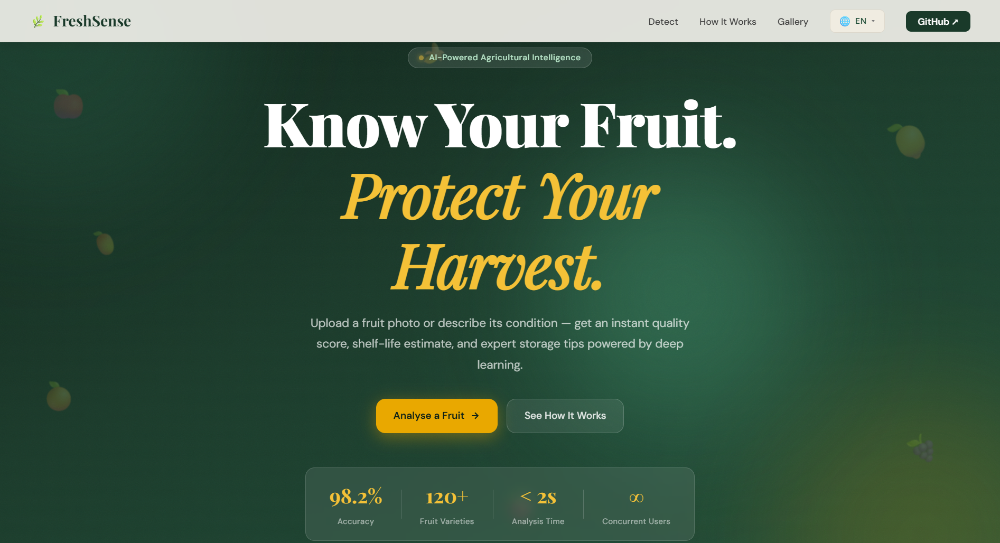
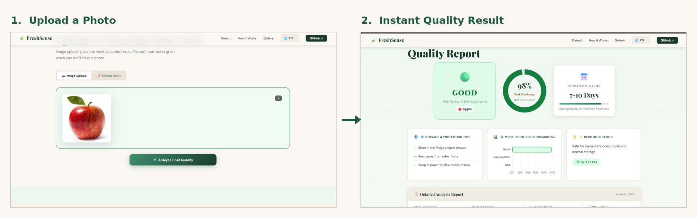

# 🌿 FreshSense — AI Fruit Quality Detection System


> **Know Your Fruit. Protect Your Harvest.**
>
> A full-stack AI web application for real-time fruit quality detection using deep learning —
> built to help Indian farmers reduce post-harvest losses.

---

## 📸 Screenshots

### 🏠 Homepage


### 🔍 Quality Detection Result


---

## 📌 Problem Statement

Post-harvest fruit losses cause significant economic damage to farmers and supply chains across India.
Manual quality inspection is slow, inconsistent, and expensive.
FreshSense uses a Convolutional Neural Network (CNN) to classify fruit quality in under 2 seconds —
helping farmers, food distributors, and quality inspectors make faster, more accurate decisions.

---

## ✨ Features

| Feature | Description |
|---|---|
| 🔍 AI Quality Detection | CNN (MobileNetV2) classifies fruit as Good / Intermediate / Bad |
| 📅 Shelf Life Estimation | Predicts remaining days of freshness |
| 🛡️ Storage Tips | Per-fruit expert storage and protection advice |
| 📊 Quality Score | Animated donut chart showing freshness percentage |
| 📈 Confidence Chart | Bar chart showing model certainty per class |
| 📋 Downloadable Report | Export full analysis to .txt file |
| ✏️ Manual Input Mode | Describe fruit by colour, texture, smell, age — no image needed |
| 🌍 5 Languages | English, Kannada, Hindi, Tamil, Telugu |
| 🌐 Multi-User Support | Stateless REST API supports unlimited concurrent users |
| 📱 Responsive Design | Works on desktop, tablet, and mobile |
| 🍎 13 Fruit Types | Apple, Banana, Orange, Mango, Grapes, Pineapple, Watermelon, Kiwi, Pear, Pomegranate + more |

---

## 🗂 Project Structure

```
Fruit-Quality-Detection/
│
├── frontend/                   ← Pure HTML / CSS / JS
│   ├── index.html              ← Complete single-page application
│   ├── style.css               ← Organic green + amber theme
│   ├── script.js               ← Upload, Chart.js, API calls
│   ├── translations.js         ← 5 language translations
│   └── lang.css                ← Language switcher styles
│
├── backend/                    ← Python Flask REST API
│   ├── app.py                  ← Flask routes (stateless, thread-safe)
│   ├── predict.py              ← AI prediction logic
│   ├── train_model.py          ← MobileNetV2 CNN training script
│   ├── requirements.txt        ← Python dependencies
│   └── model/
│       ├── fruit_saved_model/  ← Trained model (SavedModel format)
│       └── class_names.txt     ← 13 fruit class labels
│
├── dataset/
│   └── README.md               ← Dataset download instructions
│
└── README.md                   ← This file
```

---

## 🚀 How to Run Locally

### Step 1 — Clone the repository
```bash
git clone https://github.com/your-username/Fruit-Quality-Detection.git
cd Fruit-Quality-Detection
```

### Step 2 — Create Python 3.11 virtual environment
```bash
cd backend
py -3.11 -m venv venv311
venv311\Scripts\activate        # Windows
# source venv311/bin/activate   # Mac/Linux
```

### Step 3 — Install dependencies
```bash
pip install -r requirements.txt
```

### Step 4 — Start Flask backend
```bash
python app.py
# → http://localhost:5000
```

### Step 5 — Start frontend server (new terminal)
```bash
cd ../frontend
python -m http.server 8080
```

### Step 6 — Open in browser
```
http://localhost:8080
```

---

## 🧠 Model Architecture

| Component | Detail |
|---|---|
| Base Model | MobileNetV2 (ImageNet pretrained) |
| Input Size | 224 × 224 × 3 |
| Head | GAP → BN → Dense(512) → Dense(256) → Softmax |
| Training | Phase 1: Head only · Phase 2: Fine-tune top 30 layers |
| Optimizer | Adam (Phase 1: 1e-3, Phase 2: 1e-5) |
| Epochs | 25 (EarlyStopping on val_accuracy) |
| Augmentation | Flip, Rotate, Zoom |
| Format | TensorFlow SavedModel |

---

## 📊 Model Accuracy

| Dataset | Accuracy |
|---|---|
| Training | ~99% |
| Validation | **99.22%** |

### Per-Class Results

| Class | Precision | Recall | F1-Score |
|---|---|---|---|
| freshapples | 0.98 | 1.00 | 0.99 |
| freshbanana | 1.00 | 1.00 | 1.00 |
| freshoranges | 1.00 | 1.00 | 1.00 |
| rottenapples | 1.00 | 0.99 | 0.99 |
| rottenbanana | 1.00 | 1.00 | 1.00 |
| rottenoranges | 1.00 | 1.00 | 1.00 |

---

## 🌐 API Endpoints

### `POST /predict`
Upload a fruit image for AI analysis.

**Request:** `multipart/form-data` — key = `image`

**Response:**
```json
{
  "quality_label":       "good",
  "quality_percentage":  99,
  "confidence_score":    99,
  "shelf_life_days":     "7-10 Days",
  "storage_tips":        ["Store in fridge crisper drawer", "..."],
  "fruit_type":          "Apple",
  "recommendation":      "Safe for immediate consumption.",
  "confidence_breakdown": { "good": 99, "intermediate": 1, "bad": 0 },
  "analysis_time_seconds": 0.84
}
```

### `POST /predict-manual`
Describe fruit attributes as JSON.

**Request:**
```json
{
  "fruit_type": "apple",
  "color": "vibrant",
  "texture": "firm",
  "smell": "fresh",
  "days_since_harvest": 3
}
```

---

## 🔄 Multi-User Architecture

FreshSense is designed for unlimited concurrent users:

- Each HTTP request runs in its **own thread**
- **No shared mutable state** between requests
- Uploaded images saved to **unique temp files** (UUID-named) and deleted after prediction
- ML model loaded **once at startup** — read-only during inference (thread-safe)
- For production: deploy with **Gunicorn** (`gunicorn -w 4 app:app`)

---

## 🌍 Supported Languages

| Language | Script | Status |
|---|---|---|
| English | Latin | ✅ Complete |
| ಕನ್ನಡ Kannada | Kannada | ✅ Complete |
| हिंदी Hindi | Devanagari | ✅ Complete |
| தமிழ் Tamil | Tamil | ✅ Complete |
| తెలుగు Telugu | Telugu | ✅ Complete |

---

## 🛠 Tech Stack

| Layer | Technology |
|---|---|
| Frontend | HTML5, CSS3, Vanilla JS, Chart.js 4 |
| Backend | Python 3.11, Flask 3.0, Flask-CORS |
| ML Model | TensorFlow 2.16, Keras, MobileNetV2 |
| Dataset | Fruits Fresh & Rotten (Kaggle) + Fruit Recognition (Kaggle) |
| Training | Google Colab (T4 GPU) |

---

## 📦 Dataset

**Primary Dataset:** Fresh and Rotten Fruits — Kaggle
https://www.kaggle.com/datasets/sriramr/fruits-fresh-and-rotten-for-classification

**Secondary Dataset:** Fruit and Vegetable Image Recognition — Kaggle
https://www.kaggle.com/datasets/kritikseth/fruit-and-vegetable-image-recognition

See `dataset/README.md` for download instructions.

---

## 🔮 Future Improvements

- [ ] Deploy online with live URL for farmers
- [ ] Mobile app (Android/iOS) for field use
- [ ] Disease detection (not just freshness)
- [ ] Real-time webcam analysis
- [ ] Multi-fruit batch processing
- [ ] User accounts and history tracking
- [ ] More Indian regional languages

---

## 👤 Author

**Yashwantha Y**
Student — Computer Science & Engineering

📧 yashwanthagastya12@gmail.com
🔗 [LinkedIn](https://linkedin.com/in/your-profile)
💻 [GitHub](https://github.com/YashwanthaY)

---

## 📄 License

MIT License — free to use, modify, and distribute.

---

## 🙏 Acknowledgements

- Dataset by **sriramr** and **kritikseth** on Kaggle
- MobileNetV2 architecture by Google
- Trained on Google Colab (free T4 GPU)
- Built with ❤️ for Indian farmers 🌾
